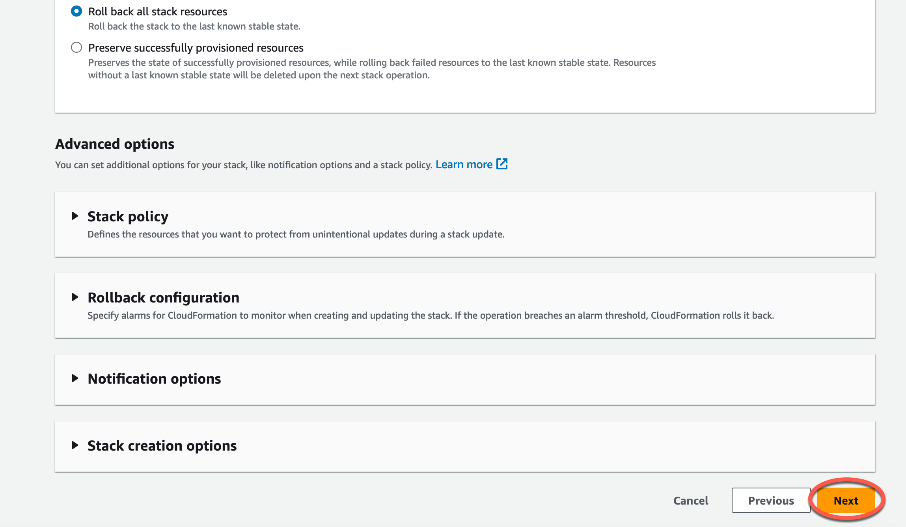
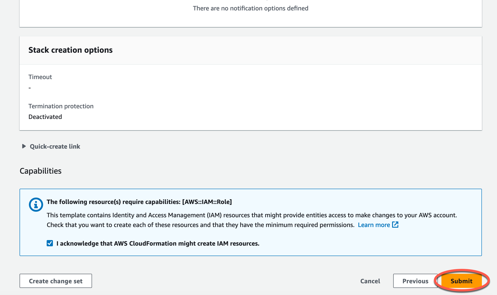
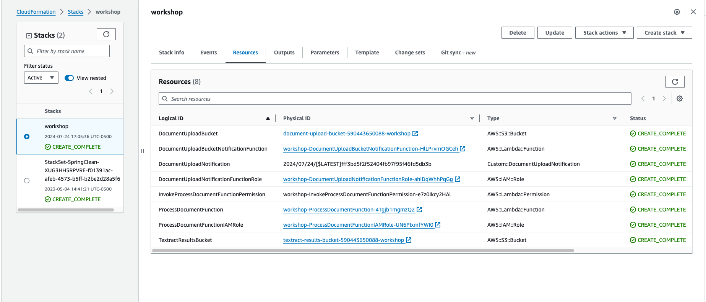
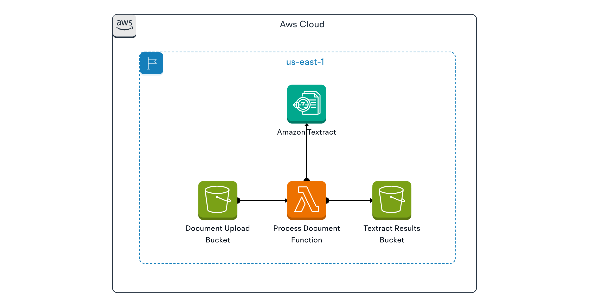

# **Overview**

**Step 1: Deploy a CloudFormation Template**
========================================
In this lab, you will execute a ready-to-go CloudFormation template that does 3 things:

-   Creates a storage bucket where you will store your files, using Amazon Simple Storage Service (Amazon S3)
-   Deploys a compute function—called a Lambda function—that triggers AWS services to act on files when they are delivered to your S3 bucket. These services will transform the information in the document into data and convert unstructured text to relevant <del>health standards.
-   Create an Identity and Access Management (IAM) role for your Lambda function that allows it to call those AWS services.

## What is CloudFormation?
AWS CloudFormation is a service that provides an easy way to create a collection of AWS and third-party resources, and provision and manage them in an orderly and predictable fashion. With an AWS CloudFormation template, you don’t have to deploy each service independently. Instead, the CloudFormation template includes all the code to deploy the specific resources you need to complete this task.

To launch the CloudFormation stack, first you need to download the CloudFormation template using this <del>[Download Template](https://static.us-east-1.prod.workshops.aws/public/0159f064-d04a-4b67-a12d-5af62f226ce5/static/template.yaml) link.

## Deploy a CloudFormation template
In this section, you will deploy a CloudFormation template. When you execute this CloudFormation template, a set of prescribed AWS services are deployed in your account. The outcome of the CloudFormation template used in this section is the creation of two S3 buckets to store files and two Lambda functions with appropriate role access permissions to trigger selected AWS services.

1.  Go to _CloudFormation_ service by using this [link](https://us-east-1.console.aws.amazon.com/cloudformation/home?region=us-east-1#/stacks/create) .
2.  Under **Prerequisite - Prepare template** section:
    -   For _Prepare template_, select **Template is ready**.
3.  Under **Specify template** section:
    -   For _Template source_, select **Upload a template file**.
    -   For _Upload a template file_, click **Choose file**, and select the file that you previously downloaded at the beginning of this section. 
4.  Click **Next**.
5.  Under the **Specify stack details** section, enter _stack name_ as `workshop`, then click **Next**. 
6.  Retain all selected default values on the **Configure stack options** screen, scroll down, then click **Next**. 
7.  In the Review screen, select the checkbox for **I acknowledge that AWS CloudFormation might create IAM resources.**, then click **Submit**. 
8.  The CloudFormation stack creation will roughly take 5-10 minutes to complete. Once the stack deployment is complete, you will see a status of _"CREATE\_COMPLETE"_. 

## Services that are deployed using the CloudFormation template
Once your CloudFormation deployment completes, the following resources will exist in your AWS environment:

-   **Two S3 buckets to store the different phases of your analyses:**
    
    - **Document Upload Bucket:** the storage location to which you’ll upload your document files. Objects saved in this S3 bucket will trigger a Lambda function to call the Amazon Textract service which extracts typed information from those document files.
    -   **Textract Results Bucket:** the storage location where the text files containing the text extracted from your document files is stored. Files saved in this bucket will trigger a Lambda function to call the Amazon Comprehend Medical service that can process unstructured text to detect health standards entities.
    
-   **One  Lambda functions, assigned the correct roles to perform their tasks:**
    -   **Process Document Function:** This Lambda function gets invoked when a document file is successfully uploaded to your **Document Upload Bucket**. The CloudFormation template establishes a configuration in the **Document Upload Bucket’s** S3 Event Notifications to notify this Lambda function that a document file was uploaded. Upon receipt of this notification, this Lambda function extracts text from the document file by calling the Amazon Textract service via API. This Lambda function then writes the extracted information to the **Textract Results Bucket** as a text file.

## Services Overview

Here is a brief overview of AWS services and concepts deployed by the CloudFormation template:

-   **S3**: Amazon Simple Storage Service (Amazon S3) is an object storage service that offers industry-leading scalability, data availability, security, and performance. Customers of all sizes and industries can use Amazon S3 to store and protect any amount of data for a range of use cases, such as data lakes, websites, mobile applications, backup and restore, archive, enterprise applications, IoT devices, and big data analytics. Amazon S3 provides management features so that you can optimize, organize, and configure access to your data to meet your specific business, organizational, and compliance requirements.
-   **IAM role**: An AWS Identity and Access Management (IAM) role is an IAM identity that you can create in your account with specific permissions. An IAM role is similar to an IAM user, in that it is an AWS identity with permission policies that determine what the identity can and cannot do in AWS. Instead of being uniquely associated with one person, a role can be assumed by anyone who needs it. Also, a role does not have standard long-term credentials such as a password or access keys associated with it. When you assume a role, it provides you with temporary security credentials for your role session.
-   **Lambda**: AWS Lambda is a compute service that lets you run code without provisioning or managing servers. With Lambda, all you need to do is supply your code in one of the language run-times that Lambda supports. Lambda runs your code on a high-availability compute infrastructure and performs all of the administration of the compute resources, including server and operating system maintenance, capacity provisioning and automatic scaling, and logging. The Lambda service runs your code—organized as Lambda functions—only when needed and scales automatically. You only pay for the compute time that you consume—there is no charge when your code is not running.
-   **Lambda execution role**: A Lambda function's execution role is an IAM role that grants the function permission to access AWS services and resources. For example, you might create an execution role with permission to send logs to Amazon CloudWatch service that allows you to collect and visualize those logs.
-   **S3 Event Notifications**: You can set up the Amazon S3 Event Notifications feature to send notifications when selected events happen in your S3 bucket. With this feature, you identify the destination for each notification. One possible notification destination is an AWS Lambda Function, which would allow you to invoke a Lambda function to perform file processing tasks.

**Congratulations!** You successfully deployed a CloudFormation template, and with it, you set up three S3 buckets, two Lambda functions, and the appropriate IAM roles for those Lambda functions!.